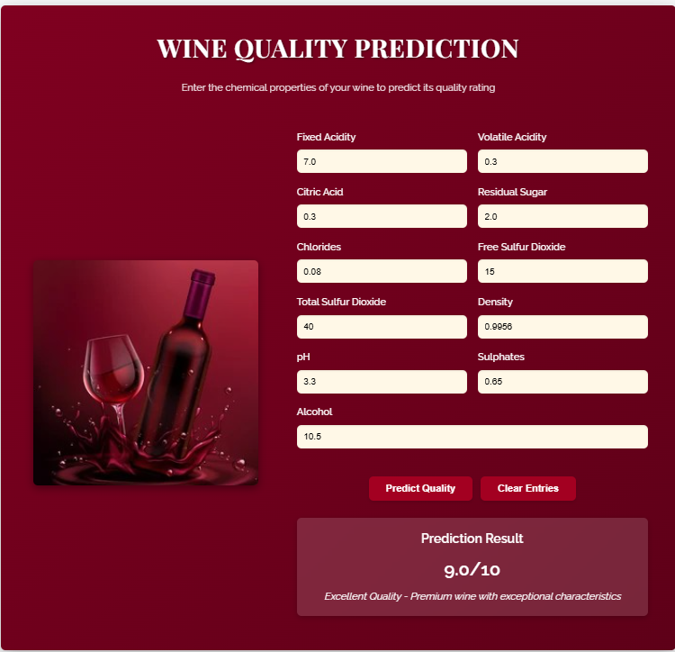

# 🍷 Wine Quality Prediction

## 📌 Project Overview
The **Wine Quality Prediction** project aims to analyze the quality of wine (both red and white) based on its chemical composition using **Machine Learning models**. This project includes **data preprocessing, model training, evaluation, and visualization** in **Power BI**.

---
## 📂 Folder Structure
```
Wine-Quality-Prediction
├── data                  # Contains datasets (CSV files)
│   ├── wine-quality-white-and-red.csv
│   ├── images.csv
│
├── notebooks             # Jupyter/Colab notebooks for data exploration & model training
│   ├── WineQuality.ipynb
│
├── src                   # Python scripts for preprocessing & model training
│   ├── app.py
│        ├── templates
│            ├── index.html
│
├── models                # Saved trained models
│   ├── wine_quality_pipeline.pkl
│   ├── best_wine_model.pkl
│
├── docs                  # Project documentation
│   ├── report.pdf
│
├── Images                # Power BI & UI screenshots
│   ├── index.png
│   ├── overview.png
│   ├── analysis.png
│   ├── html_ui.png
│
├── README.md             # Project description
├── requirements.txt      # Required Python libraries
├── LICENSE               # Open-source license
```

---

## 📊 Dataset Information
- **Dataset Source:** [Kaggle - Wine Quality Dataset](https://www.kaggle.com/datasets/ruthgn/wine-quality-data-set-red-white-wine/data)
- **Data Description:** Contains physicochemical tests of **red and white wine samples** along with quality ratings.
- **Target Variable:** `quality` (ranges from 0-10, representing wine quality)
- **Features:**
  - `fixed acidity`
  - `volatile acidity`
  - `citric acid`
  - `type`
  - `residual sugar`
  - `chlorides`
  - `free sulfur dioxide`
  - `total sulfur dioxide`
  - `density`
  - `pH`
  - `sulphates`
  - `alcohol`

---

## 📌 Implementation Steps
### **1️⃣ Data Preprocessing**
- **Handling Missing Values** (if any)
- **Feature Scaling** using StandardScaler
- **Splitting Data** into training and testing sets
- **Encoding Target Variable** (Converting into classification problem)

### **2️⃣ Model Training**
We implemented **5 ML models**:
- **Random Forest** 🌳
- **K-Nearest Neighbors (KNN)** 🔍
- **Decision Tree** 🌿
- **Gradient Boosting** 📈
- **Support Vector Classifier (SVC)** 🏹

### **3️⃣ Model Evaluation**
- **Accuracy Score**
- **Precision, Recall, and F1-Score**
- **Confusion Matrix & ROC Curve**
- **Power BI Visualizations** 📊

### **4️⃣ Power BI Dashboard**
- **Index Page:** Shows dataset summary & wine distribution
- **Overview Page:** Data preprocessing & feature importance
- **Analysis Page:** Model performance comparison

### **Live Preview**
- **PowerBi Live Preview:**[Click Here](https://app.powerbi.com/view?r=eyJrIjoiOTIwYWYyY2MtOTZiYS00MWUxLWI3NzgtMmFkYTFjMmZmMDZlIiwidCI6ImRhYTU5MmNhLWRlN2ItNGM1NC04ODM2LTkxYTY2OTBmZTE5NyJ9&pageName=dd74d0105ec518cb7330)
- **NovyPro Live Preview:**[Novypro Live](https://project.novypro.com/PVlKsk)
- **Ui Live Privew:**[Redirect To Render](https://wine-quality-analysis-38rf.onrender.com)


---

## 🔥 Power BI Dashboard (Screenshots)

### Index Page


### Overview Page


### Analysis Page


### HTML UI


---

## 📊 Dashboard Sections

### 📋 Index Page
The **Index Page** provides an overall summary of the wine dataset and distribution, including:
- Total number of wine samples (both red and white)
- Distribution of wine quality
- Summary statistics of key features
- Correlation between different wine properties
- Percentage of each wine type in the dataset

This page serves as the entry point to understand the dataset before diving into model details.

---

### 🔍 Overview Page
The **Overview Page** focuses on the data preprocessing steps and feature importance:
- Feature engineering techniques applied
- Importance of each feature in predicting wine quality
- Distribution of features across different quality levels
- Outlier detection and handling strategies
- Data transformation methods used

This section helps understand which chemical properties have the most significant impact on wine quality.

---

### 📈 Analysis Page
The **Analysis Page** provides a comprehensive view of model performance:
- Comparison of accuracy, precision, recall, and F1-score across all models
- Confusion matrices for each model
- ROC curves and AUC scores
- Detailed performance metrics for both red and white wine predictions
- Model hyperparameters and optimization results

This section helps identify which model performs best for wine quality prediction.

---

## 📌 Source Code (src Folder)

### app.py
The `app.py` file is the FastAPI web application that serves as the prediction interface. It:
- Loads the trained machine learning models
- Exposes API endpoints for wine quality prediction
- Provides a simple HTML user interface for input and results
- Handles both red and white wine prediction requests
- Returns prediction results with confidence scores
- Includes data validation and error handling
- Offers documentation via Swagger UI

The application is built with FastAPI for high performance and easy deployment, making the wine quality prediction model accessible through a web interface or API calls.

---

## 🛠️ Requirements
All required Python libraries are listed in `requirements.txt`.

```
numpy
pandas
scikit-learn
matplotlib
seaborn
jupyterlab
fastapi
uvicorn
powerbiclient
```

Install them using:
```
pip install -r requirements.txt
```

---

## 🚀 GitHub Submission Steps
1. Create a GitHub repository and **push all files**
2. Write meaningful **commit messages**
3. Include **README.md, requirements.txt, and LICENSE**
4. Attach the **Power BI report (PDF/Markdown)**
5. Share the **GitHub repository link** before the deadline.

---

## 📌 Contact Information
📧 Email: [sonikirtan2004@gmail.com](mailto:sonikirtan2004@gmail.com)  
🔗 LinkedIn: [Kirtan Soni](https://www.linkedin.com/in/kirtansoni02/)  

---

## 📜 License
This project is open-source under the **MIT License**.

---


✅ **If you found this useful, give it a ⭐ on GitHub!** 🚀
